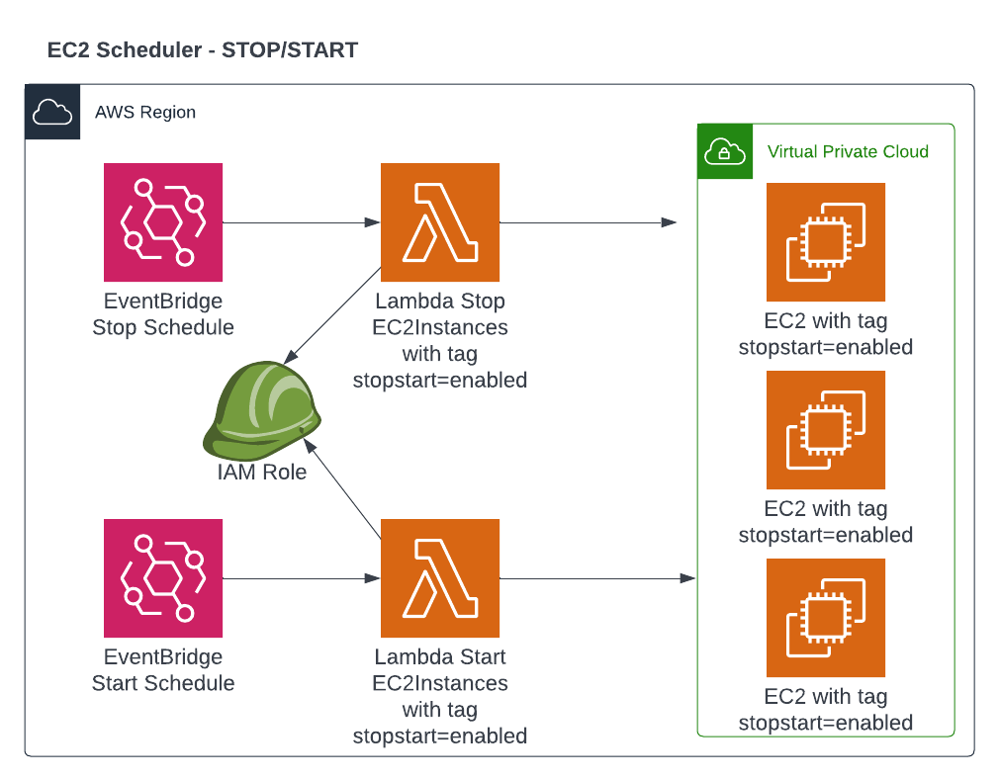

# AWS EC2 Scheduler to STOP and START EC2 Instances

## This Terraform deploy:
 - Lambda Function to Stop EC2 Instances with specific Tag
 - Lambda Function to Start EC2 Instances with specific Tag
 - EventBridge Rule to Stop EC2 Instances by CRON schedule
 - EventBridge Rule to Start EC2 Instances by CRON schedule
 - CloudWatch Log Group for Lambda Stop EC2
 - CloudWatch Log Group for Lambda Start EC2
 - IAM Role with IAM Policy to Describe/Stop/Start EC2

<br>
> __Note__ <br><br>
<b>Cron schedules are in UTC time Zone!</b>

Cron Expression examples:
 * https://docs.aws.amazon.com/eventbridge/latest/userguide/eb-create-rule-schedule.html
 * https://docs.aws.amazon.com/lambda/latest/dg/services-cloudwatchevents-expressions.html

Examples:
```
start_cron_schedule = "cron(00 07 * * ? *)"  # Start Servers at 07:00 UTC
stop_cron_schedule  = "cron(00 17 * * ? *)"  # Stop  Servers at 17:00 UTC
```

How to use with all Default:
```
module "ec2_scheduler_default" {
  source = "github.com/adv4000/aws-ec2-scheduler.git"
}
```

How to use with all Custom:
```
module "ec2_scheduler_custom" {
  source              = "github.com/adv4000/aws-ec2-scheduler.git"
  name                = "my-ec2-scheduler"
  stop_cron_schedule  = "cron(00 16 * * ? *)"
  start_cron_schedule = "cron(00 08 * * ? *)"

  stopstart_tags = {
    TagKEY   = "stopstart_me"
    TagVALUE = "yes"
  }

  tags = {
    Owner = "Denis Astahov"
  }
}

```
# Copyleft (c) by Denis Astahov ADV-IT
